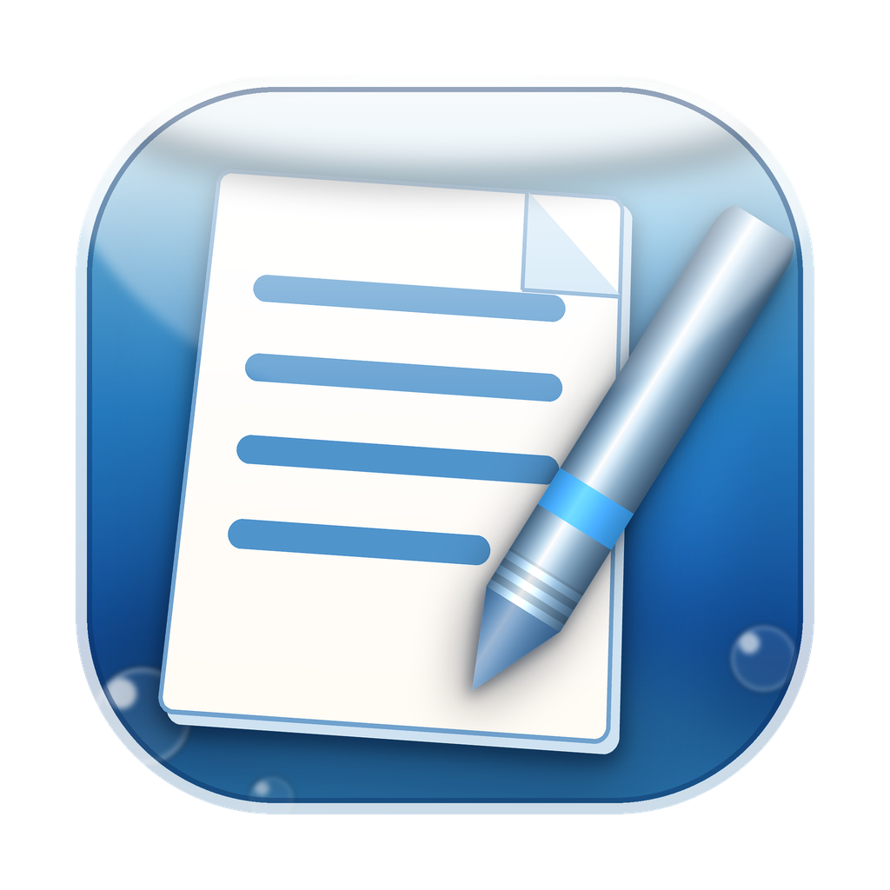

<p align="center">
  
</p>

<h1 align="center">Aereluna Note</h1>

<p align="center">
  <strong>A note to the future we were promised.</strong><br>
  <em>An offline Markdown editor inspired by Frutiger Aero.</em>
</p>

<p align="center">
  <strong>The future became intelligent.<br>
  I just wanted it to feel beautiful again.</strong>
</p>

<p align="center">
  Built by a human, accelerated by AI.
</p>


---

# Why This Exists

We already have incredible editors.

They write with us.

They sync across every device.

They understand our language.

Some can even finish our sentences.

They're amazing.

But every time I opened one, I felt like something had quietly disappeared.

Not functionality.

A feeling.

Back in the early 2000s, people imagined the future differently.

Transparent glass.

Blue skies.

Soft gradients.

Rounded interfaces.

Light floating through translucent windows.

Technology didn't just promise convenience.

It promised hope.

It felt calm.

It felt kind.

It felt like tomorrow would always be a little brighter than today.

Years later, people gave this aesthetic a name:

**Frutiger Aero.**

Somewhere along the way, the future became more efficient.

It became more connected.

It became more intelligent.

But it also became colder.

So I built the editor I wanted to open every morning.

Not to compete with Obsidian.

Not to replace Typora.

Not to become another AI workspace.

Just a quiet place to write.

A place that reminds me of the future we once imagined.

---

# My Product Philosophy

Modern software keeps growing.

More plugins.

More collaboration.

More notifications.

More dashboards.

More AI.

More everything.

Aereluna Note deliberately moves in the opposite direction.

One file.

Three formatting buttons.

No accounts.

No cloud.

No subscriptions.

No distractions.

Because writing isn't about having more tools.

It's about having fewer things between your thoughts and the page.

---

# Features

### 🌊 Frutiger Aero

Inspired by one of the most optimistic design languages ever created.

Glass.

Gradients.

Soft light.

Gentle colors.

A future that smiled instead of shouting.

Writing should feel beautiful—not merely productive.

---

### 🔒 Fully Offline

No internet connection required.

No cloud.

No telemetry.

No tracking.

No accounts.

Everything stays on your computer.

Supports:

- Markdown (.md)
- PDF export

Your words belong to you.

---

### 💻 Runs Anywhere

Built with Electron.

Run it:

- directly from a single HTML file
- as a native macOS application
- inside any modern browser

Windows and Linux support are planned.

---

# Two Ways to Run

Both versions use exactly the same `AerelunaNote.html`.

## Browser

Download `AerelunaNote.html`.

Double-click.

Start writing.

No installation.

No dependencies.

No build process.

Chrome and Edge support true in-place saving through the File System Access API.

Safari and Firefox simply download a new copy when saving.

---

## Desktop (Electron)

Requires Node.js 18+

```bash
git clone <your-repository>

cd aereluna-note

npm install

npm start

npm run dist
```

The desktop version adds:

- Native macOS menus
- Open / Save / Save As
- Native PDF export
- Finder support for `.md`
- Open Recent
- Proper unsaved-change dialogs

---

# What It Does

- Fully offline
- Live Markdown preview
- Three formatting buttons
- Undo & Redo
- Golden Ratio split (61.8 : 38.2)
- Scroll synchronization
- Dark mode by default
- PDF export
- Automatic draft recovery

Nothing more.

Nothing less.

---

# Keyboard Shortcuts

| Action | Shortcut |
|---------|----------|
| Bold | `⌘B` |
| Italic | `⌘I` |
| Underline | `⌘U` |
| Undo | `⌘Z` |
| Redo | `⌘⇧Z` |
| New | `⌘N` |
| Open | `⌘O` |
| Save | `⌘S` |
| Save As | `⌘⇧S` |
| Export PDF | `⌘P` |
| Toggle Dark Mode | `⌘⇧D` |
| Reset Split | `⌘0` |

---

# Supported Markdown

Aereluna Note intentionally supports the Markdown features people actually use.

- Headings
- Bold
- Italic
- Underline
- Strikethrough
- Links
- Images
- Inline code
- Code blocks
- Tables
- Task lists
- Nested lists
- Blockquotes
- Horizontal rules

Files remain plain Markdown and work perfectly with GitHub, Typora, Obsidian, VS Code, and countless other editors.

No proprietary format.

No lock-in.

---

# Storage

While you're writing, your document is quietly mirrored into `localStorage`.

If you accidentally close the window, your draft will still be waiting.

When you're ready, press `⌘S`.

Your work is saved as a plain Markdown file.

Simple.

Future-proof.

Yours.

---

# Built by a Human, Accelerated by AI

Aereluna Note wouldn't exist without AI.

Not because AI designed it.

It didn't.

The ideas.

The atmosphere.

The aesthetics.

The tiny interactions.

The philosophy.

Those all came from a human.

AI simply removed the distance between imagination and software.

A few years ago, building a desktop application like this would have taken months.

Today, one person can sit down with an idea, a conversation, and enough curiosity...

…and slowly watch it become real.

That's my favorite thing about AI.

Not that it replaces creativity.

But that it gives more people permission to create.

---

# Project Structure

```
AerelunaNote.html   Standalone editor
main.js             Electron main process
preload.js          Secure renderer bridge
package.json        Electron configuration
build/icon.png      Application icon
```

---

# Roadmap

This project intentionally grows slowly.

Things I'd love to explore:

- Native Windows support
- Native Linux support
- Better typography
- More Frutiger Aero themes
- Better PDF layout
- Optional local AI assistance (still offline-first)

No cloud.

No subscriptions.

No feature bloat.

Just thoughtful improvements.

---

# Contributing

If Aereluna Note reminds you of the future you imagined growing up...

If Frutiger Aero still makes you smile...

If software can be both useful and beautiful...

You're welcome here.

Pull requests, ideas, bug reports, and conversations are all appreciated.

---

# License

MIT

---

<p align="center">

### The future became intelligent.

### I just wanted it to feel beautiful again.

<br>

**Rediscover the future we were promised.**

</p>
